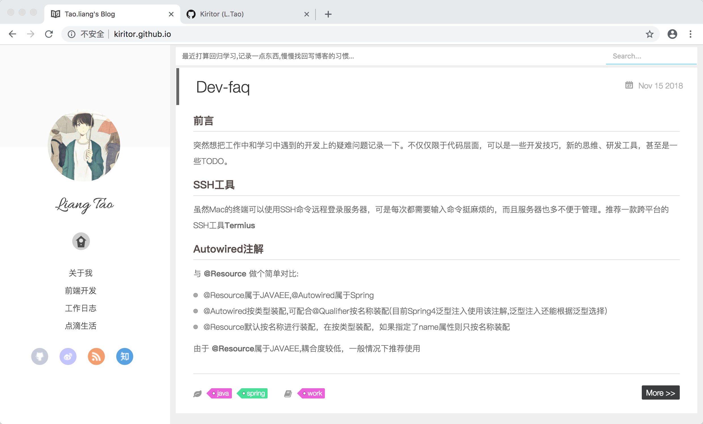

hexo-theme-yilia-l
================
修改自yilia主题:[yilia](https://github.com/litten/hexo-theme-yilia)

笔者非常喜欢yilia主题的简洁、优雅,极致的性能体验。不过其界面的排版不是非常满意,因此就自己改装了下.改了相关样式,新增了一些新鲜的功能:

1. 状态栏(最近的一些动态)
2. 微简历(简单的介绍信息,只在首页现实)
3. 文章目录(只在文章页显示)
4. 最新评论(只在首页显示)

这是直接把我博客里面的主题拿了出来,有很多没有清理的地方,暂时也懒的弄了.先这样!
具体的效果图如下:
###首页

详细的界面demo:[kiritor](http://kiritor.github.io)